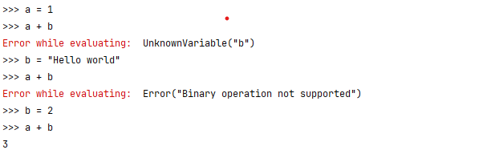
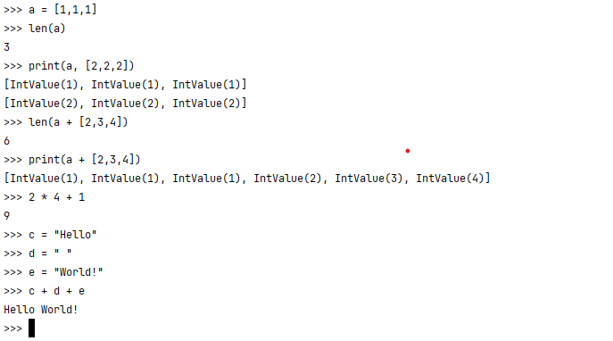

# Interpreter of ABr language

This project is an interpreter for a programming language that I created: the **ABr** language

ABR = **A**rthur **Br**icq

A programming language parser and its interpreter that I made to learn more about **parsing**, **programming language theory** and how **interpreters** work. 

## Features of the language

The language is a sort of mix between C-syntax (with the concept of *expressions* and *statements*) that is very similar to Python (*variables are typed only at runtime*)

The features of languages are the following.

- C-like differentiation of expressions and statements
- Python-like typed variables: `a = 1`
  - Currently supported types: `bool`, `int`, `list`, `string`
- Python-like functions: `fn foo(first_arg, second_arg)`
  - Like in python, variables are typed but the type is not declared. Furthermore, it is possible to change the type of variables.
- Python-like list: `my_list = [1,2,3]`
  - access: `my_list[0]`
  - mutation: `new_list = my_list + [4]`
- If, Else-If, Else: `if (false) {foo()} else {bar()}`
- Comments after `//`
- A **standard-library** with basic functions:
  - `print(a,b,c)` to print many variables
  - `len(my_list)` to get the length of a list
- All common math operation supported and can be used in a shell.

Furthermore, the parser and interpreter comes with a full supports for error. Here's an example of this.



I surely agree that the syntax of this language is weird. This is mostly because I had no clear vision of what I would do, when I would stop, and what would be more difficult. Really, this is a learning project.

## Examples

### Hello world

```c
fn hello_world() {
  print("Hello world!");
}

fn main() {
  // A small example that illustrates how to print `Hello world` on the screen
  hello_world();
  return 0;
}
```

### Fibonacci with recursive function

The famous Fibonacci example,  with a recursive call.

```c
fn fib(n) {
  if (n == 0) {return 0;}
  if (n == 1) {return 1;}
  return fib(n - 1) + fib(n - 2);
}
```

### Fibonacci with a loop

Same example, but to print the first n-values in order

```c
/// A function that prints the n first values of the Fibonacci sequence.
/// Note that this function does not use recursive function but instead illustrates
/// how to use a loop.
fn print_fib_until(n) {
    first = 0;
    second = 1;
    next = first + second;
    
    if (n <= 0) { return -1; }
    print(first); 
    
    // print the first values
    if (n >= 1) { print(second); }
    if (n >= 2) { print(next); }
    
    // check that there is a loop needed
    if (n < 3) { return 0; }
    
    n = n - 2;
    loop {
        first = second;
        second = next;
        next = first + second;
        n = n - 1;
        print(next);
        if (n == 0) { break; }
    }
    
    return 0;
}
```

## Shell-like interpreter

By running `cargo run`, you can immediately start using the interpreter



# Missing features

These features are missing for ABr to be 'ready'

- More operator: ||, &&
- Char

